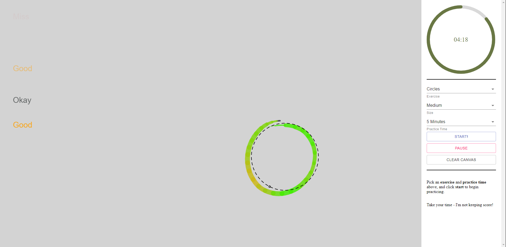

# Digital Art Warmup Tool

This was the result of a particularly bad bout of insomnia from me. It was getting hard to tell if the lines and circles I was drawing were straight without guides, and the guides I had on hand were too consistent.

So I wrote this - _it is very much hacked together quickly_ - a tool to practice drawing some arbitrary lines and circles. Maybe ovals at some point, if I get to it. Probably won't for a bit.

Demo:
[https://sessamekesh.github.io/draw-warmup](https://sessamekesh.github.io/draw-warmup)

Screenshot:

## Building

Local development: `npm run-script start`
Production build: `npm run-script build-prod` (notice: you'll have to update dependencies in index.html to point to React cdn)

## Contributing

This project is a piece of shit, but it's very useful to me at least. Maybe it is to you. I'll gladly accept pull requests.